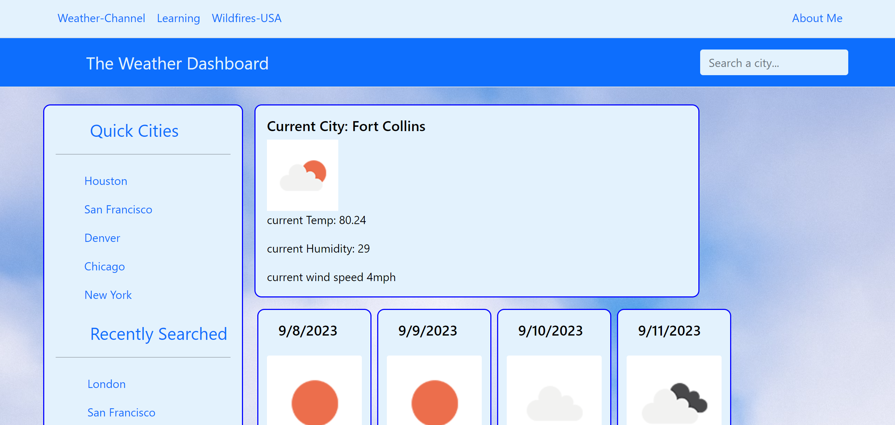

# weather-dashboard
Weather website featuring bootstrap, jquery, and third party APIs

## Description

A website that gives a weather forecast for an input city.

## Installation

N/A

## Usage

The reason behind the website is to display my ability to use jquery and pull from 3rd party API data sets. 

## License

MIT

## Credits

UDenver Bootcamp Course

## Website Screenshot
[Nick Fillip's Portfolio LINK](nfillip.github.io/fillip-portfolio/)

